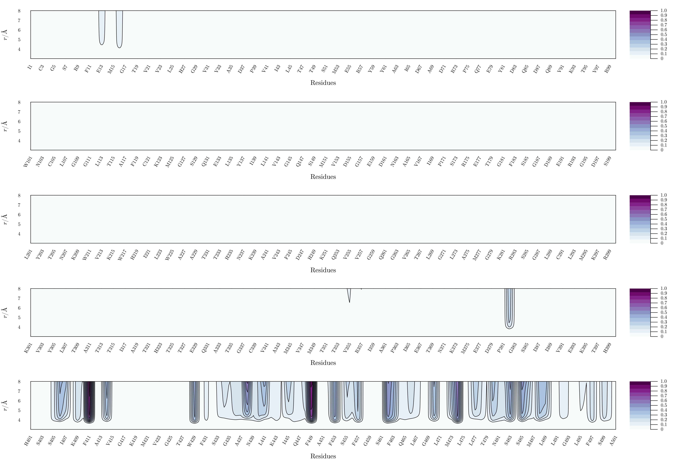
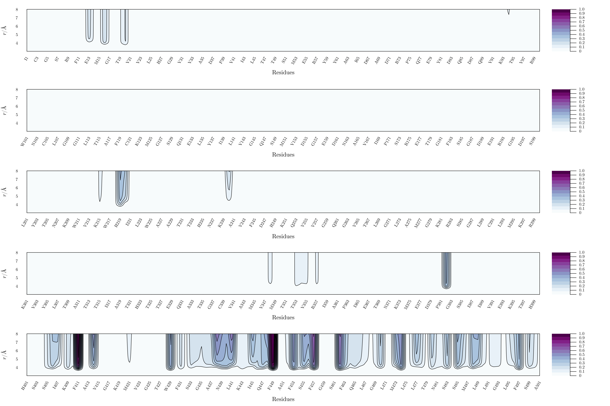

# Supplementary Figures

The `plots/` directory provides detailed visualizations of the key findings from our coarse-grained simulation study of the Zika virus. These plots are organized to facilitate understanding of the solvation dynamics, lipid-protein interactions, and temporal coordination number analyses.

For easy reference:

* Water Molecule Distribution: Includes 2D density maps showing the spatial distribution of WT4 water molecules around protein chains, as well as time-resolved analyses of water coordination near symmetry axes.
* Phospholipid Interactions: Visualizations of solvation patterns for specific lipids (POPC, POPE, and POPS) near the protein shell, separated into envelope and membrane protein contributions.
* Lipid Pair Comparisons: Weighted differences in coordination numbers between lipid pairs, categorized by protein domain and chain type.
* Time-Dependent Coordination Analysis: GIFs and density maps showing how coordination numbers evolve over time, highlighting chain-specific and lipid-specific trends.
* Lipid-Protein Coordination Decomposition: Detailed analyses of coordination numbers for beads of lipids and protein, providing a deeper understanding of interaction patterns.

### 1. WT4 Water Molecules and the Protein Shell
***
**1.1. Envelope Protein**

<figure class="image">
  
  <figcaption><strong>Figure S1.</strong> 2D density map depicting the distribution of WT4 water molecules around chain K in the protein envelope.</figcaption>
</figure>

<figure class="image">
  
  <figcaption><strong>Figure S2.</strong> A 2D density map illustrating the spatial distribution of water molecules surrounding chain M within the protein envelope</figcaption>
</figure>

<figure class="image">
  
  <figcaption><strong>Figure S3.</strong> WT4 water molecules density surrounding the chain O inside the protein envelope. </figcaption>
</figure>

**1.2. Membrane Protein**

<figure class="image">
  
  <figcaption><strong>Figure S4.</strong> Spatial arrangement of water molecules near the chain L within the membrane protein.</figcaption>
</figure>

<figure class="image">
  
  <figcaption><strong>Figure S5.</strong> Hydration of chain N of M protein including all 75 residues.</figcaption>
</figure>

<figure class="image">
  
  <figcaption><strong>Figure S6.</strong> Visualization of solvation density surrounding chain P within the membrane protein, as shown in a 2D density map.</figcaption>
</figure>

**1.3. Symmetry Axes**

<figure class="image">
  
  <figcaption><strong>Figure S7.</strong> Time-resolved analysis of the coordination number at the 2-fold axis, calculated with a stride of 273 frames.</figcaption>
</figure>

<figure class="image">
  
  <figcaption><strong>Figure S8.</strong> Evolution of the coordination number over time  at the 3-fold axis, sampled every ~20 ns (stride of 273 frames) in a 10101-frame simulation spanning 2000 ns.</figcaption>
</figure>

<figure class="image">
  
  <figcaption><strong>Figure S9.</strong> Temporal evaluation of the coordination number at the 5-fold axis, with frames analyzed at ~20-ns intervals over the course of the 2000-ns simulation (stride: 273 frames).</figcaption>
</figure>

### 2. Phospholipids and the Protein Shell
***

 **2.1. POPC**

**2.1.1. Envelope Protein**
<figure class="image">
  
  <figcaption><strong>Figure S10.</strong> XXX.</figcaption>
</figure>

<figure class="image">
  
  <figcaption><strong>Figure S11.</strong> XXX.</figcaption>
</figure>

<figure class="image">
  
  <figcaption><strong>Figure S12.</strong> XXX.</figcaption>
</figure>

**2.1.2. Membrane Protein**

<figure class="image">
  
  <figcaption><strong>Figure S13.</strong> XXX.</figcaption>
</figure>

<figure class="image">
  
  <figcaption><strong>Figure S14.</strong> XXX.</figcaption>
</figure>

<figure class="image">
  
  <figcaption><strong>Figure S15.</strong> XXX.</figcaption>
</figure>

 **2.2. POPE**

**2.2.1. Envelope Protein**

<figure class="image">
  
  <figcaption><strong>Figure S16.</strong> XXX.</figcaption>
</figure>

<figure class="image">
  
  <figcaption><strong>Figure S17.</strong> XXX.</figcaption>
</figure>

<figure class="image">
  
  <figcaption><strong>Figure S18.</strong> XXX.</figcaption>
</figure>

**2.2.2. Membrane Protein**

<figure class="image">
  
  <figcaption><strong>Figure S19.</strong> XXX.</figcaption>
</figure>

<figure class="image">
  
  <figcaption><strong>Figure S20.</strong> XXX.</figcaption>
</figure>

<figure class="image">
  
  <figcaption><strong>Figure S21.</strong> XXX.</figcaption>
</figure>

 **2.3. POPS**

**2.3.1. Envelope Protein**

<figure class="image">
  
  <figcaption><strong>Figure S22.</strong> XXX.</figcaption>
</figure>

<figure class="image">
  
  <figcaption><strong>Figure S23.</strong> XXX.</figcaption>
</figure>

<figure class="image">
  
  <figcaption><strong>Figure S24.</strong> XXX.</figcaption>
</figure>

**2.3.2. Membrane Protein**

<figure class="image">
  
  <figcaption><strong>Figure S25.</strong> XXX.</figcaption>
</figure>

<figure class="image">
  
  <figcaption><strong>Figure S26.</strong> XXX.</figcaption>
</figure>

<figure class="image">
  
  <figcaption><strong>Figure S27.</strong> XXX.</figcaption>
</figure>

### 3. Weighted Differences in Coordination Numbers Among Lipid Pairs

**3.1. Envelope Protein**

<figure class="image">
  
  <figcaption><strong>Figure S28.</strong> XXX.</figcaption>
</figure>

<figure class="image">
  
  <figcaption><strong>Figure S29.</strong> XXX.</figcaption>
</figure>

<figure class="image">
  
  <figcaption><strong>Figure S30.</strong> XXX.</figcaption>
</figure>

<figure class="image">
  
  <figcaption><strong>Figure S31.</strong> XXX.</figcaption>
</figure>

<figure class="image">
  
  <figcaption><strong>Figure S32.</strong> XXX.</figcaption>
</figure>

<figure class="image">
  
  <figcaption><strong>Figure S33.</strong> XXX.</figcaption>
</figure>

<figure class="image">
  
  <figcaption><strong>Figure S34.</strong> XXX.</figcaption>
</figure>

<figure class="image">
  
  <figcaption><strong>Figure S35.</strong> XXX.</figcaption>
</figure>

<figure class="image">
  
  <figcaption><strong>Figure S36.</strong> XXX.</figcaption>
</figure>

**3.2. Membrane Protein**

<figure class="image">
  
  <figcaption><strong>Figure S37.</strong> XXX.</figcaption>
</figure>

<figure class="image">
  
  <figcaption><strong>Figure S38.</strong> XXX.</figcaption>
</figure>

<figure class="image">
  
  <figcaption><strong>Figure S39.</strong> XXX.</figcaption>
</figure>

<figure class="image">
  
  <figcaption><strong>Figure S40.</strong> XXX.</figcaption>
</figure>

<figure class="image">
  
  <figcaption><strong>Figure S41.</strong> XXX.</figcaption>
</figure>

<figure class="image">
  
  <figcaption><strong>Figure S42.</strong> XXX.</figcaption>
</figure>

<figure class="image">
  
  <figcaption><strong>Figure S43.</strong> XXX.</figcaption>
</figure>

<figure class="image">
  
  <figcaption><strong>Figure S44.</strong> XXX.</figcaption>
</figure>

<figure class="image">
  
  <figcaption><strong>Figure S45.</strong> XXX.</figcaption>
</figure>

## 4. Time-dependent Assessment of the Coordination Number

**4.1. WT4 Water Molecules**

**4.1.1. Time and Chain-Averaged Contributions**

**4.1.1.1. Envelope Protein**
<figure class="image">
  
  <figcaption><strong>Figure S46.</strong> XXX.</figcaption>
</figure>

**4.1.1.2. Membrane Protein**

<figure class="image">
  
  <figcaption><strong>Figure S47.</strong> XXX.</figcaption>
</figure>

**4.1.2. Time-Averaged Contributions**

**4.1.2.1. Envelope Protein**

<figure class="image">
  
  <figcaption><strong>Figure S48.</strong> XXX.</figcaption>
</figure>

**4.1.2.2. Membrane Protein**

<figure class="image">
  
  <figcaption><strong>Figure S49.</strong> XXX.</figcaption>
</figure>

**4.2. Lipid Membrane**

**4.2.1. Time and Chain-Averaged Contributions**

**4.2.1.1. Envelope Protein**
<figure class="image">
  
  <figcaption><strong>Figure S50.</strong> XXX.</figcaption>
</figure>

<figure class="image">
  
  <figcaption><strong>Figure S51.</strong> XXX.</figcaption>
</figure>

<figure class="image">
  
  <figcaption><strong>Figure S52.</strong> XXX.</figcaption>
</figure>

**4.2.1.2. Membrane Protein**

<figure class="image">
  
  <figcaption><strong>Figure S53.</strong> XXX.</figcaption>
</figure>

<figure class="image">
  
  <figcaption><strong>Figure S54.</strong> XXX.</figcaption>
</figure>

<figure class="image">
  
  <figcaption><strong>Figure S55.</strong> XXX.</figcaption>
</figure>

**4.2.2. Time-Averaged Contributions**

**4.2.2.1. Envelope Protein**
<figure class="image">
  
  <figcaption><strong>Figure S56.</strong> XXX.</figcaption>
</figure>

<figure class="image">
  
  <figcaption><strong>Figure S57.</strong> XXX.</figcaption>
</figure>

<figure class="image">
  
  <figcaption><strong>Figure S58.</strong> XXX.</figcaption>
</figure>

**4.2.2.2. Membrane Protein**

<figure class="image">
  
  <figcaption><strong>Figure S59.</strong> XXX.</figcaption>
</figure>

<figure class="image">
  
  <figcaption><strong>Figure S60.</strong> XXX.</figcaption>
</figure>

<figure class="image">
  
  <figcaption><strong>Figure S61.</strong> XXX.</figcaption>
</figure>

### 5. Decomposition of Lipid-Protein Coordination Numbers
***

**5.1. POPC**

<figure class="image">
  
  <figcaption><strong>Figure S62.</strong> XXX.</figcaption>
</figure>

<figure class="image">
  
  <figcaption><strong>Figure S63.</strong> XXX.</figcaption>
</figure>

<figure class="image">
  
  <figcaption><strong>Figure S64.</strong> XXX.</figcaption>
</figure>

<figure class="image">
  
  <figcaption><strong>Figure S65.</strong> XXX.</figcaption>
</figure>

<figure class="image">
  
  <figcaption><strong>Figure S66.</strong> XXX.</figcaption>
</figure>

<figure class="image">
  
  <figcaption><strong>Figure S67.</strong> XXX.</figcaption>
</figure>

<figure class="image">
  
  <figcaption><strong>Figure S68.</strong> XXX.</figcaption>
</figure>

<figure class="image">
  
  <figcaption><strong>Figure S69.</strong> XXX.</figcaption>
</figure>

**5.2. POPE**

<figure class="image">
  
  <figcaption><strong>Figure S70.</strong> XXX.</figcaption>
</figure>

<figure class="image">
  
  <figcaption><strong>Figure S71.</strong> XXX.</figcaption>
</figure>

<figure class="image">
  
  <figcaption><strong>Figure S72.</strong> XXX.</figcaption>
</figure>

<figure class="image">
  
  <figcaption><strong>Figure S73.</strong> XXX.</figcaption>
</figure>

<figure class="image">
  
  <figcaption><strong>Figure S74.</strong> XXX.</figcaption>
</figure>

<figure class="image">
  
  <figcaption><strong>Figure S75.</strong> XXX.</figcaption>
</figure>

<figure class="image">
  
  <figcaption><strong>Figure S76.</strong> XXX.</figcaption>
</figure>

<figure class="image">
  
  <figcaption><strong>Figure S77.</strong> XXX.</figcaption>
</figure>

**5.3. POPS**

<figure class="image">
  
  <figcaption><strong>Figure S78.</strong> XXX.</figcaption>
</figure>

<figure class="image">
  
  <figcaption><strong>Figure S79.</strong> XXX.</figcaption>
</figure>

<figure class="image">
  
  <figcaption><strong>Figure S80.</strong> XXX.</figcaption>
</figure>

<figure class="image">
  
  <figcaption><strong>Figure S81.</strong> XXX.</figcaption>
</figure>

<figure class="image">
  
  <figcaption><strong>Figure S82.</strong> XXX.</figcaption>
</figure>

<figure class="image">
  
  <figcaption><strong>Figure S83.</strong> XXX.</figcaption>
</figure>

<figure class="image">
  
  <figcaption><strong>Figure S84.</strong> XXX.</figcaption>
</figure>

<figure class="image">
  
  <figcaption><strong>Figure S85.</strong> XXX.</figcaption>
</figure>